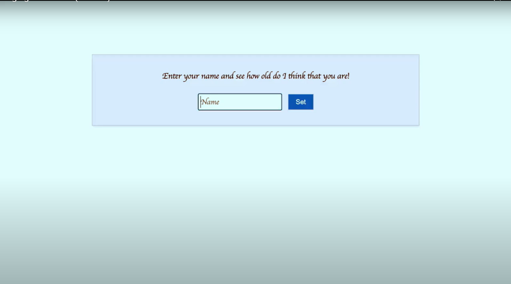

# Age Guesser

## Overview

Welcome to the **Age Guesser** app! This web application estimates your age based on your name using the agefi.io. Built with HTML, CSS, and JavaScript, it provides a fun way to guess your age.

- **Technologies Used**: This section includes icons for each technology used in your project, with links to their respective documentation.
  - **HTML**:  linked to [HTML Documentation](https://developer.mozilla.org/en-US/docs/Web/HTML).
  - **CSS**:  linked to [CSS Documentation](https://developer.mozilla.org/en-US/docs/Web/CSS).
  - **JavaScript**:  linked to [JavaScript Documentation](https://developer.mozilla.org/en-US/docs/Web/JavaScript).
  - **Vite**:  linked to [Vite Documentation](https://vitejs.dev/).
  - **Node.js**:  linked to [Node.js Documentation](https://nodejs.org/).

## Features

- **Age Estimation**: Enter your name, and the app will estimate your age using the AgeFI API.
- **Simple Interface**: Clean and intuitive design with HTML, CSS, and JavaScript.
- **Modern Build Tools**: Utilizes Vite for development and build processes.

## Demo video
[](https://www.youtube.com/watch?v=GkJo6Ae3axM)

## Installation

To get started with the Age Guesser app, follow these steps:

1. **Clone the Repository:**

2. **Install Dependencies:**
```
npm install
```

3. **Development**
To start the development server, run:
```
npm run dev
```

### License
This project is licensed under the MIT License

### Contact
Vanja Maric
email: maricvanj@gmail.com